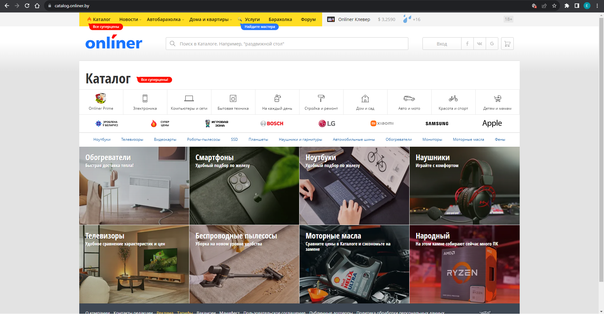
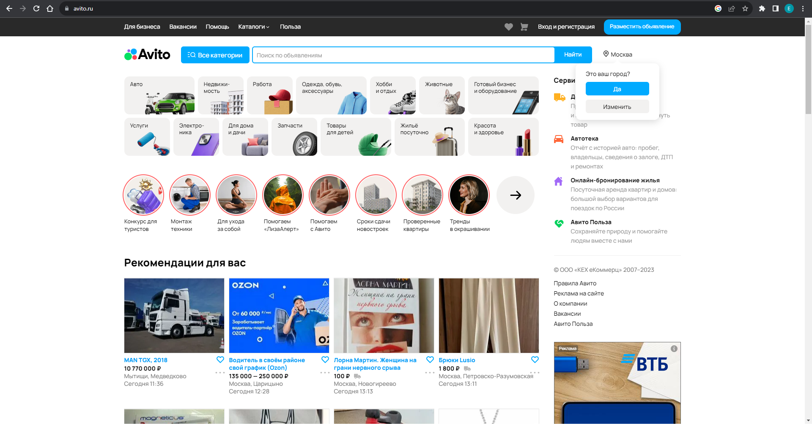
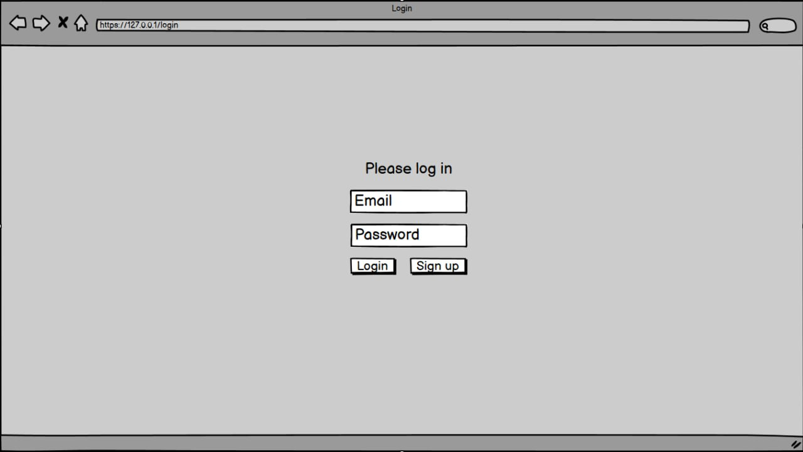
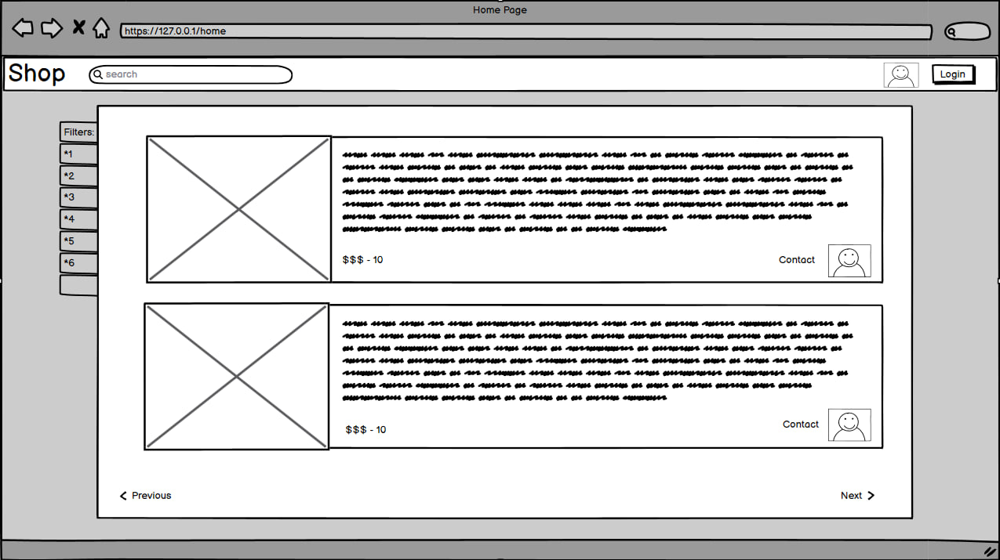

# Требования к проекту
---

# 1 Введение

## 1.1 Назначение
Веб-приложение "Интернет-магазин" предназначено для того, чтобы ползволить пользователям совершать покупки в интернете, не выходя из дома.

## 1.2 Аналоги

### 1.2.1 Onliner

**Русский интерфейс:** есть  
**Цена:** бесплатный  
**Ссылка на сайт производителя:** https://www.onliner.by

Главная страница Onliner  

Onliner - белорусский сайт, включающий в себе маркетплейс различных товаров и услуг. Также включает в себя СМИ и форум.
<a name="c_organizer"/>

## 1.2.2 Avito
**Русский интерфейс:** есть  
**Цена:** бесплатно  
**Ссылка на сайт производителя:** https://www.avito.ru

Главная страница Onliner
  

Avito - российский интернет-сервис, предназначенный для размещения объявлений о продажи или предоставлении различных тоаваров и услуг. 

# 2 Требования пользователя

## 2.1 Интерфейс пользователя
Интерфейс пользователя будет состоять из следующих элементов:
1. Страница входа в приложение. На этой странице пользователю предлагается войти в аккаунт, если он существует. В противном случае предлагается зарегестрировать новый аккаунт.
2. Страница регистрации. На этой странице пользователю предлагается зарегестрировать новый аккаунт, если он существует.
3. Страница профиля. На данной странице можно разместить объявление о продаже товара, просмотреть корзину с добавленными в нее товарами и просмотреть избранные товары. Также на странице профиля можно изменить данные аккаунта.
4. Страница товара. На ней можно просмотреть данные о товаре (название, цена, пользователя, который его добавил), добавить товар в корзину либо в избранное.
5. Главная страница. На ней можно просмотреть все добавленные товары, отсортировать их, перейти на страницу своего профиля либо на страницу товара.

Страница входа в аккаунт

Главная страница

### 2.2 Аудитория приложения
Целевой аудиторией данного веб-приложения могут быть люди различных возрастов с минимальной технической граммотностью.

# 3 Системные требования

## 3.1 Функциональные требования

### 3.1.1 Основные функции

#### 3.1.1.1 Вход пользователя в приложение
Без создание либо входа в учетную запись пользователь не может создавать/редактировать/добавлять в корзину объявления.

#### 3.1.1.2 Настройка профиля активного пользователя
Зарегистрированный и авторизованный пользователь имеет возможность редактировать своё имя и пароль, создавать новые объявления или редактировать старые.

#### 3.1.1.3 Добавление записей
После входа пользователя в приложение или после завершения радактирования профиля зарегистрированным пользователем возможно создание новых объявлений, добавление существующих объявлений в избранное или добавление существующих товаров в корзину.

#### 3.1.1.4 Выход зарегистрированного пользователя из учётной записи
Зарегистрированный пользователь имеет возможность выйти из учётной записи.

### 3.1.2 Ограничения и исключения
1. Отсутствует возможность пользоваться приложением, не имея учётной записи. 

## 3.2 Нефункциональные требования

### 3.2.1 Требования к безопасности
Приложение предоставляет возможность просмотра и редактирования профиля только авторизированному пользователю.
